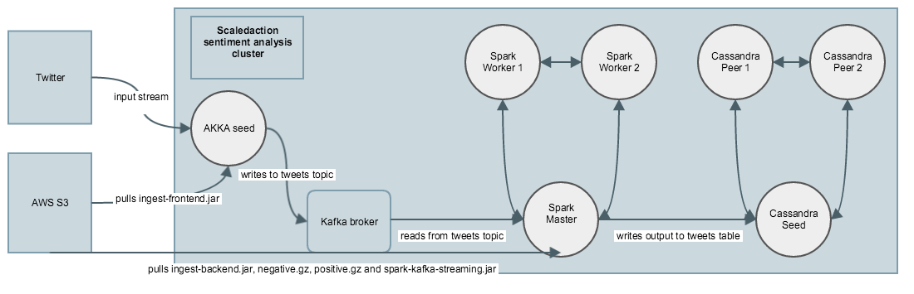

# Scaledaction sentiment-analysis DTK deployment procedure

This document is guide for deploying Scaledaction sentiment-analysis cluster via DTK. Following is the diagram of Scaledaction cluster:


 
- Service module used is: **scaledaction:sentiment_analysis**
- Assembly template is: **cluster**

Assembly template has following nodes:
- **akka-seed** - Node where ingest-frontend akka jar is running and pickup stream from Twitter. This node has connection to Kafka broker to be able to write output to tweets topic
- **kafka-broker** - Node where Kafka is installed, kafka broker is running and tweets topic is created
- **spark-master** - Spark master node where ingest-backend jar is running, picking up messages from Kafka broker, doing processing and writing output to tweets table in Cassandra
- **spark-workers** - Two additional nodes that act as Spark workers inside spark cluster. Number of these nodes is scalable if needed
- **cassandra-seed** - Cassandra seed node
- **cassandra-peer** - Two additional nodes that act as Cassandra peer nodes inside cassandra cluster. Number of these nodes is scalable if needed

## DTK Deployment demo:
Following part of the guide shows procedure of deploying Scaledaction sentiment-analysis cluster.
You need to first login to the scaledaction ec2 instance and run dtk-client:
```
$ ssh -i testing_use1.pem ubuntu@scaledaction.dtk.io
Welcome to Ubuntu 14.04.3 LTS (GNU/Linux 3.13.0-74-generic x86_64)

 * Documentation:  https://help.ubuntu.com/

  System information as of Wed Apr 20 07:21:32 UTC 2016

  System load:  0.0               Processes:              128
  Usage of /:   44.9% of 7.74GB   Users logged in:        0
  Memory usage: 25%               IP address for eth0:    10.0.0.198
  Swap usage:   0%                IP address for docker0: 172.17.0.1

  Graph this data and manage this system at:
    https://landscape.canonical.com/

  Get cloud support with Ubuntu Advantage Cloud Guest:
    http://www.ubuntu.com/business/services/cloud

71 packages can be updated.
38 updates are security updates.


*** System restart required ***
Last login: Wed Apr 20 07:21:34 2016 from 80.65.166.98
ubuntu@ip-10-0-0-198:~$ sudo su - dtk-scaledaction
dtk-scaledaction@ip-10-0-0-198:~$ dtk-shell
dtk:/>
```

Next step is to stage scaledaction:sentiment_analysis/cluster and set needed attributes:

```
dtk:/service-module/scaledaction:sentiment_analysis>stage cluster scaledaction_cluster -v master
---
new_service_instance:
  name: scaledaction_cluster
  id: 2147494165
  is_created: true
 
dtk:/service-module/scaledaction:sentiment_analysis>cd
dtk:/>cd service
dtk:/service>cd scaledaction_cluster
dtk:/service/scaledaction_cluster>set-required-attributes

Please fill in missing data.
Please enter akka-seed/scaledaction_common::akka/tweet_subject [STRING]:
: <TWEET_SUBJECT>
Please enter akka-seed/scaledaction_common::akka/twitter_consumer_key [STRING]:
: <TWITTER_CONSUMER_KEY>
Please enter akka-seed/scaledaction_common::akka/twitter_consumer_secret [STRING]:
: <TWITTER_CONSUMER_SECRET>
Please enter akka-seed/scaledaction_common::akka/twitter_token_key [STRING]:
: <TWITTER_TOKEN_KEY>
Please enter akka-seed/scaledaction_common::akka/twitter_token_secret [STRING]:
: <TWITTER_TOKEN_SECRET>
Please enter akka-seed/setup::credentials_aggregator/aws_access_key [STRING]:
: <AWS_ACCESS_KEY>
Please enter akka-seed/setup::credentials_aggregator/aws_secret_key [STRING]:
: <AWS_SECRET_KEY>
--------------------------------- DATA ---------------------------------
akka-seed/scaledaction_common::akka/tweet_subject : <TWEET_SUBJECT>
akka-seed/scaledaction_common::akka/twitter_consumer_key : <TWITTER_CONSUMER_KEY>
akka-seed/scaledaction_common::akka/twitter_consumer_secret : <TWITTER_CONSUMER_SECRET>
akka-seed/scaledaction_common::akka/twitter_token_key : <TWITTER_TOKEN_KEY>
akka-seed/scaledaction_common::akka/twitter_token_secret : <TWITTER_TOKEN_SECRET>
akka-seed/setup::credentials_aggregator/aws_access_key : <AWS_ACCESS_KEY>
akka-seed/setup::credentials_aggregator/aws_secret_key : <AWS_SECRET_KEY>
------------------------------------------------------------------------

Is provided information ok? (yes|no) yes
dtk:/service/sentiment_analysis-cluster>
```

Now that we have all attributes set, we can start with deployment process. Deployment process is divided in separate actions. We have following actions:
- **initial_setup** - Initial setup of aws credentials and cli on all nodes where interaction with AWS S3 service will be needed. You can take a look at diagram above to see which nodes are connected to AWS S3
- **create_kafka_cluster** - Action which deploys kafka broker and creates topic: tweets
- **create_cassandra_cluster** - Action which deploys cassandra cluster and creates keyspace: twitter and table: tweets
- **create_akka_cluster** - Action which pulls ingest-frontend.jar from AWS S3
- **create_spark_cluster** - Action which deploys spark cluster and pulls ingest-backend.jar from AWS S3 on spark master node
- **run_ingest_frontend** - This action exports needed environment variables on akka-seed node and runs ingest-frontend jar as background service (with nohup)
- **run_ingest_backend** - This action exports needed environment variables on spark-master node and runs ingest-backend jar as background service (with nohup)

We will execute these actions in following order:

```
dtk:/service/scaledaction_cluster>exec-sync initial_setup
========================= start 'initial_setup' =========================


============================================================
STAGE 1: create_nodes_stage
TIME START: 2016-04-20 08:13:06 +0000
OPERATION: CreateNodes
  kafka-broker
  cassandra-seed
  akka-seed
  spark-master
  cassandra-peers:1
  cassandra-peers:2
  spark-workers:1
  spark-workers:2

STATUS: succeeded
DURATION: 168.5s
------------------------------------------------------------

============================================================
STAGE 2: bigtop_multiservice
TIME START: 2016-04-20 08:15:55 +0000
COMPONENT: assembly_wide/bigtop_multiservice
STATUS: succeeded
DURATION: 0.1s
------------------------------------------------------------

============================================================
STAGE 3: bigtop hiera
TIME START: 2016-04-20 08:15:55 +0000
COMPONENTS:
  kafka-broker/bigtop_multiservice::hiera
  akka-seed/bigtop_multiservice::hiera
  spark-master/bigtop_multiservice::hiera
  node-group:spark-workers/bigtop_multiservice::hiera
STATUS: succeeded
DURATION: 123.5s
------------------------------------------------------------

============================================================
STAGE 4: bigtop_base
TIME START: 2016-04-20 08:17:59 +0000
COMPONENTS:
  kafka-broker/bigtop_base
  akka-seed/bigtop_base
  spark-master/bigtop_base
  node-group:spark-workers/bigtop_base
STATUS: succeeded
DURATION: 18.2s
------------------------------------------------------------

============================================================
STAGE 5: aws setup
TIME START: 2016-04-20 08:18:17 +0000
COMPONENT: akka-seed/setup::credentials_aggregator
STATUS: succeeded
DURATION: 8.7s
------------------------------------------------------------

========================= end: 'initial_setup' (total duration: 319.6s) =========================
Status: OK
dtk:/service/scaledaction_cluster>
dtk:/service/scaledaction_cluster>exec-sync create_kafka_cluster
========================= start 'create_kafka_cluster' =========================


============================================================
STAGE 1: set zookeeper conf
TIME START: 2016-04-20 08:23:15 +0000
COMPONENTS:
  assembly_wide/zookeeper
  kafka-broker/zookeeper::server
STATUS: succeeded
DURATION: 34.0s
------------------------------------------------------------

============================================================
STAGE 2: kafka broker conf
TIME START: 2016-04-20 08:23:49 +0000
COMPONENTS:
  kafka-broker/kafka::broker
  kafka-broker/kafka::topic[tweets]
STATUS: succeeded
DURATION: 34.1s
------------------------------------------------------------

========================= end: 'create_kafka_cluster' (total duration: 68.3s) =========================
Status: OK
dtk:/service/scaledaction_cluster>exec-sync create_cassandra_cluster
========================= start 'create_cassandra_cluster' =========================


============================================================
STAGE 1: host aggregator
TIME START: 2016-04-20 08:28:00 +0000
COMPONENT: assembly_wide/cassandra::cluster
STATUS: succeeded
DURATION: 0.1s
------------------------------------------------------------

============================================================
STAGE 2: cassandra seed setup
TIME START: 2016-04-20 08:28:00 +0000
COMPONENTS:
  cassandra-seed/cassandra::java
  cassandra-seed/cassandra::seed
STATUS: succeeded
DURATION: 31.3s
------------------------------------------------------------

============================================================
STAGE 3: install cassandra and scaledaction cassandra setup
TIME START: 2016-04-20 08:28:32 +0000
COMPONENTS:
  cassandra-seed/cassandra
  cassandra-seed/scaledaction_common::cassandra
STATUS: succeeded
DURATION: 45.9s
------------------------------------------------------------

============================================================
STAGE 4: cassandra peers setup
TIME START: 2016-04-20 08:29:18 +0000
COMPONENT: node-group:cassandra-peers/cassandra::java
STATUS: succeeded
DURATION: 30.7s
------------------------------------------------------------

============================================================
STAGE 5: install cassandra
TIME START: 2016-04-20 08:29:49 +0000
COMPONENT: node-group:cassandra-peers/cassandra
STATUS: succeeded
DURATION: 45.7s
------------------------------------------------------------

============================================================
STAGE 6: scaledaction cassandra create keyspace and table
TIME START: 2016-04-20 08:30:35 +0000
COMPONENTS:
  cassandra-seed/scaledaction_common::cassandra
  cassandra-seed/scaledaction_common::cassandra
STATUS: succeeded
DURATION: 96.5s
------------------------------------------------------------

========================= end: 'create_cassandra_cluster' (total duration: 250.9s) =========================
Status: OK
dtk:/service/scaledaction_cluster>exec-sync create_akka_cluster
========================= start 'create_akka_cluster' =========================


============================================================
STAGE 1: get scaledaction frontend app from S3
TIME START: 2016-04-20 08:34:25 +0000
COMPONENTS:
  akka-seed/setup
  akka-seed/s3::get_bucket_data[sentiment-ingest-frontend-assembly-1.0.jar]
  akka-seed/scaledaction_common::akka
  spark-master/setup
STATUS: succeeded
DURATION: 85.9s
------------------------------------------------------------

========================= end: 'create_akka_cluster' (total duration: 85.9s) =========================
Status: OK
dtk:/service/scaledaction_cluster>exec-sync create_spark_cluster
========================= start 'create_spark_cluster' =========================


============================================================
STAGE 1: get scaledaction backend app from S3
TIME START: 2016-04-20 08:38:15 +0000
COMPONENTS:
  akka-seed/setup
  spark-master/setup
  spark-master/scaledaction_common::spark
  spark-master/s3::get_bucket_data[sentiment-ingest-backend-assembly-1.0.jar]
  spark-master/s3::get_bucket_data[positive.gz]
  spark-master/s3::get_bucket_data[negative.gz]
  spark-master/s3::get_bucket_data[spark-streaming-kafka_2.10-1.5.1.jar]
STATUS: succeeded
DURATION: 66.9s
------------------------------------------------------------

============================================================
STAGE 2: spark master and client
TIME START: 2016-04-20 08:39:22 +0000
COMPONENTS:
  spark-master/spark::master
  spark-master/spark::client
STATUS: succeeded
DURATION: 51.7s
------------------------------------------------------------

============================================================
STAGE 3: spark worker
TIME START: 2016-04-20 08:40:14 +0000
COMPONENTS:
  node-group:spark-workers/spark::common
  node-group:spark-workers/spark::worker
STATUS: succeeded
DURATION: 51.3s
------------------------------------------------------------

========================= end: 'create_spark_cluster' (total duration: 170.3s) =========================
Status: OK
dtk:/service/scaledaction_cluster>exec-sync run_ingest_frontend
========================= start 'run_ingest_frontend' =========================


============================================================
STAGE 1: execute ingest frontend
TIME START: 2016-04-20 08:41:32 +0000
ACTION: akka-seed/scaledaction_common::akka.run_scaledaction_frontend
STATUS: succeeded
DURATION: 5.4s
RESULTS:

NODE: akka-seed
RUN: /bin/bash /etc/puppet/modules/scaledaction_common/files/run_akka_frontend.sh dLc54z8GOmG5a0ZhoZYB6OA89 TQNK2EulOjAlHlF7btCO0ihKlWBAQfxZ0I7oqnvdvafwPxFSUt 708804878752067584-sxP6TyEOjXUePcO2AKOJaDYZNOxq4zx kFBCVhZzqkuI2GjEQaVc7z3a3e0FpaMbj5bYHvaH0GJB1 ec2-52-87-225-248.compute-1.amazonaws.com 6667 /tmp sentiment-ingest-frontend-assembly-1.0.jar Apple (syscall)
RETURN CODE: 0

------------------------------------------------------------

========================= end: 'run_ingest_frontend' (total duration: 5.4s) =========================
Status: OK
dtk:/service/scaledaction_cluster>exec-sync run_ingest_backend
========================= start 'run_ingest_backend' =========================


============================================================
STAGE 1: execute ingest backend
TIME START: 2016-04-20 08:41:47 +0000
ACTION: spark-master/scaledaction_common::spark.run_scaledaction_backend
STATUS: succeeded
DURATION: 5.4s
RESULTS:

NODE: spark-master
RUN: /bin/bash /etc/puppet/modules/scaledaction_common/files/run_spark_backend.sh ec2-52-87-225-248.compute-1.amazonaws.com 6667 ec2-52-90-76-142.compute-1.amazonaws.com /usr/lib/spark/lib/spark-assembly-1.5.1-hadoop2.6.0.jar /tmp/spark-streaming-kafka_2.10-1.5.1.jar /tmp sentiment-ingest-backend-assembly-1.0.jar /tweet-corpus (syscall)
RETURN CODE: 0

------------------------------------------------------------

========================= end: 'run_ingest_backend' (total duration: 5.4s) =========================
```

Finally, when we have all actions are executed, it is time to check whether our cluster works properly and if it is streaming tweets from Twitter all the way to the Cassandra tweets table. The easiest way to check this is to login to cassandra-seed node and use cqlsh prompt to check content of tweets tables:

```
dtk:/service/scaledaction_cluster>grant-access ec2-user test
Access to system user 'ec2-user' has been granted for 'test' (spark-workers:1)
Access to system user 'ec2-user' has been granted for 'test' (spark-workers:2)
Access to system user 'ec2-user' has been granted for 'test' (akka-seed)
Access to system user 'ec2-user' has been granted for 'test' (spark-master)
Access to system user 'ec2-user' has been granted for 'test' (cassandra-peers:1)
Access to system user 'ec2-user' has been granted for 'test' (cassandra-peers:2)
Access to system user 'ec2-user' has been granted for 'test' (kafka-broker)
Access to system user 'ec2-user' has been granted for 'test' (cassandra-seed)
dtk:/service/scaledaction_cluster>cd cassandra-
Identifier 'cassandra-' is not valid.
dtk:/service/scaledaction_cluster>cd cassandra-seed
dtk:/service/scaledaction_cluster/cassandra-seed>ssh ec2-user
TIP: You can save your identity file as '/home/dtk-scaledaction/dtk/dtk.pem' and it will be used as default identityfile.
You are entering SSH terminal (ec2-user@ec2-52-90-76-142.compute-1.amazonaws.com) ...
Warning: Permanently added 'ec2-52-90-76-142.compute-1.amazonaws.com,10.0.0.127' (ECDSA) to the list of known hosts.
Last login: Wed Apr 20 08:43:04 2016 from 80.65.166.98

       __|  __|_  )
       _|  (     /   Amazon Linux AMI
      ___|\___|___|

https://aws.amazon.com/amazon-linux-ami/2015.09-release-notes/
27 package(s) needed for security, out of 73 available
Run "sudo yum update" to apply all updates.
Amazon Linux version 2016.03 is available.
[ec2-user@ip-10-0-0-127 ~]$ cqlsh ec2-52-90-76-142.compute-1.amazonaws.com
Connected to Cassandra_Test_Cluster at ec2-52-90-76-142.compute-1.amazonaws.com:9042.
[cqlsh 5.0.1 | Cassandra 2.2.5 | CQL spec 3.3.1 | Native protocol v4]
Use HELP for help.
cqlsh> use twitter;
cqlsh:twitter> select * from tweets;

 tweet                                                                                                                                                    | batchtime     | query | score | tweet_text
----------------------------------------------------------------------------------------------------------------------------------------------------------+---------------+-------+-------+----------------------------------------------------------------------------------------------------------------------------
 {"query": "Apple", "text": "#BAMA2016PlatinumEdition_IbtissamTiskat #BigAppleMusicAwardsBestSocialMediaStar2016_IbtissamTiskat https://t.co/3D7uxO06RE"} | 1461141850000 | Apple |     1 | #BAMA2016PlatinumEdition_IbtissamTiskat #BigAppleMusicAwardsBestSocialMediaStar2016_IbtissamTiskat https://t.co/3D7uxO06RE
  {"query": "Apple", "text": "#Setting4Success Apple refused China request for source code in last two years: lawyer #News #smallbusiness #entrepreneur"} | 1461141818000 | Apple |     1 |  #Setting4Success Apple refused China request for source code in last two years: lawyer #News #smallbusiness #entrepreneur

(2 rows)
cqlsh:twitter>
```

## Conclusion
As you can see, end-to-end process for Scaledaction sentiment analysis was deployed successfully as we see tweets with query "Apple" get processed through sentiment analysis pipeline and get eventually written in Cassandra tweets table
